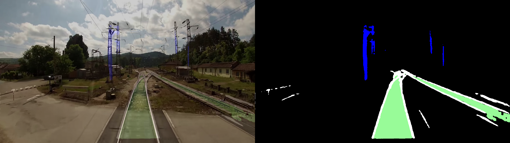

# Yolov8 Multitask Seg Det Internship 2024

## Description
This project focuses on optimizing safety and operations in the `railway` environment by developing a `multi-task` model. 
The model leverages the `YOLOv8` architecture, combining object detection and semantic segmentation to identify potential obstacles, tracks, and analyze track-specific data. 
This project addresses unique challenges in the rail sector by adapting solutions from autonomous vehicles. 
The model is trained and evaluated to ensure high accuracy and reliability.

 

## Visuals

 

## Key Features
  * **Multitask Learning**: Integrated detection and segmentation tasks in a single model.
  * **Environment-Specific**: Designed specifically for railway scenarios.
  * **YOLOv8 Framework**: For real-time performance.

 

## Project Structure Overview
The Yolov8 model was finetuned on the [RailSem19](https://www.wilddash.cc/railsem19) dataset. All the code of the project can be found in the `Notebooks`.The model weights can be found on this [link](https://drive.google.com/drive/folders/10WByknRYAVb6IEjjyxw3LcoL3jUG9yUc?usp=sharing).
  Here's an overview of the project

### **1. Exploratory Data Analysis (EDA)**  
**Dataset Familiarization**: understand its structure and annotations for both object detection and semantic segmentation.  
**Class Selection**: Focused on specific classes relevant to project objectives:  
  - **Detection**:  
    - **Track-signal**: Railway traffic light signals.  
    - **Track-sign**: Signs along railways.  
    - **Vehicle**: Includes cars, trucks, and trains.  
    - **Person**: Critical for safety in railway environments.  
  - **Segmentation**:  
    - **Track**: Railway tracks for monitoring and maintenance.  
    - **Rail**: Metal components of the tracks.  
    - **Pole**: Structures supporting electrical systems (e.g., catenaries).  

 

### **2. Training Process**  
The Training process can be found in the `Training.ipynb` Notebook.
**Model Architecture**:  
  - Based on YOLOv8, chosen for its high real-time performance and precision.  
  - Includes a shared pre-trained **backbone** for both detection and segmentation tasks, adapted from a multitask model for autonomous vehicles.  
  - Features **four necks**: one for detection and three for segmentation **(tracks, rails, and poles)**.  

**Model Architecture**: 

**Weight Transfer**:  
The weights of the model are transferred from a backbone and segmentation weights of an autonomous vehicle multitask model, here's an overview of the transfer:  
    - **Lane segmentation** -> **Rail segmentation**.  
    - **Drivable areas** -> **Track segmentation**.  
    - **Pole class** was trained from scratch due to lack of transferability.  
    - **Detection Head** was trained from scratch also.

 

### **3. Prediction**  
We performed predictions on both images and videos, The codes for the prediction can be found respectively in `Predict Image.ipynb` and `Predict Video.ipynb` Notebooks.
  - **In-dataset images**: From RailSem19 dataset.
    

  - **Out-of-domain videos**: Real-world railway scenarios to evaluate generalization.
  

   
 

### **4. Evaluation and Metrics**  

To evaluate the performance of the multitask model, we employed standard metrics for both detection and segmentation:  

- **Detection Metrics**: mAP@50, mAP@50-95, Precision, and Recall.  
- **Segmentation Metrics**: Pixel Accuracy, Mean Intersection over Union (mIoU), and Line Accuracy.  

These metrics provide a comprehensive evaluation of the model's ability to accurately detect and segment key features in the railway environment. 
Detailed calculations can be found in the `Metrics.ipynb` Notebook.  

 

## Results
### **Speed**
| Batch Size | Speed (FPS)          |
|------------|----------------------|
| 1          | 37.06 FPS            |
| 32         | 75.77 FPS            |

---

### **Detection Metrics**
| Metric      | Value   |
|-------------|---------|
| Precision   | 0.111  |
| Recall      | 0.584   |
| mAP50       | 0.208   |
| mAP50-95    | 0.101   |

---

### **Segmentation Metrics**
| Class       | Pixel Accuracy | Line Accuracy | mIoU   |
|-------------|----------------|---------------|--------|
| Track       | 0.984          | 0.915         | 0.88   |
| Rail        | 0.984          | 0.802         | 0.749  |
| Pole        | 0.98           | 0.666         | 0.633  |

